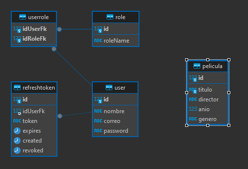

# Prueba Técnica: Películas

API RESTful para CRUD de Películas:
Implemente una API RESTful para gestionar películas utilizando su framework web preferido
(por ejemplo, Flask, Express, Django, etc.). La API debe permitir realizar operaciones CRUD
(Crear, Leer, Actualizar, Eliminar) en películas.


[](https://www.mysql.com/)

[](https://https://nuget.org/)
[](https://learn.microsoft.com/es-es/dotnet/csharp/)


**Table of Contents**📑

[TOCM]

[TOC]

## Descripcion del proyecto 🌟

La API se implementa con NETCORE - EntityFramework, estructurado a 4 capas para garantizar su robustes y escalabilidad, su base datos se implementa con MYSQL, el archivo del script de la DB se encuentra en la carpeta Db, en esta se muestra su diseño, cuenta con una entidad basica para los requisitos basicos solicitados, las otras tablas cumplirían con la funcion de agregar seguridad al proyecto a traves de JWT.


## Caracteristicas 📈

El Proyecto incluye Versionado, RateLimit, JWT
En la versión por defecto es 1.0, esta incluye los metodos solicitados.
En la versión 1.1, se incluye todos lo metodos GET que incluyen paginado.

### Endpoints 🔗

#### Crear
Metodo: POST
/api/Peliculas

##### Entrada
- Body:
```json 
{
    "titulo": "string",
    "director": "string",
    "anio": 0,
    "genero": "string"
}
```
##### Salida

- Codigo de estado HTTP 201

```json 
{
    "titulo": "string",
    "director": "string",
    "anio": 0,
    "genero": "string",
    "id":0
}
```

#### Obtener

Metodo: GET
/api/Peliculas

##### Salida

- Codigo de estado HTTP 204

```json 
{
    "titulo": "string",
    "director": "string",
    "anio": 0,
    "genero": "string",
    "id":0
}
```

#### Obtener por ID

Metodo: GET
/api/Peliculas/{id}

##### Entrada
id = id de la pelicula buscada

##### Salida

- Codigo de estado HTTP 204

```json 
{
    "titulo": "string",
    "director": "string",
    "anio": 0,
    "genero": "string",
    "id":0
}
```

#### Actualizar

Metodo: PUT
/api/Peliculas/{id}

##### Entrada
id = id de la pelicula deseada
- Body:
```json 
{
    "titulo": "string",
    "director": "string",
    "anio": 0,
    "genero": "string"
}

##### Salida
```json 
{
    "titulo": "string",
    "director": "string",
    "anio": 0,
    "genero": "string",
    "id":0
}
```

#### Eliminar

Metodo: DELETE
/api/Peliculas/{id}

##### Entrada
id = id de la pelicula deseada
- Body:
```json 
{
    "titulo": "string",
    "director": "string",
    "anio": 0,
    "genero": "string"
}
```
##### Salida

- Codigo de estado HTTP 204

## Tecnologias 💻

-   NetCore 7.0
-   MySQL
-   GitHub

### Lenguajes Usados 💬

-   C#
-   MYSQL

### Dependencias Usadas 📦


#### Dependencias del BackEnd 🔧
-   "AspNetCoreRateLimit"
-   "AutoMapper.Extensions.Microsoft.DependencyInjection"
-   "Microsoft.AspNetCore.Authentication.JwtBearer"
-   "Microsoft.AspNetCore.Mvc.Versioning"
-   "Microsoft.AspNetCore.OpenApi"
-   "Microsoft.EntityFrameworkCore"
-   "Microsoft.EntityFrameworkCore.Design"
-   "Microsoft.Extensions.DependencyInjection"
-   "Swashbuckle.AspNetCore"
-   "System.IdentityModel.Tokens.Jwt"
-   "Microsoft.IdentityModel.Tokens"
-   "Serilog.AspNetCore"
-   "FluentValidation.AspNetCore"
-   "itext7.pdfhtml"
-   "Pomelo.EntityFrameworkCore.MySql"
-   "CsvHelper"

## Estructura de la DataBase 🧱

> Estructura General.

